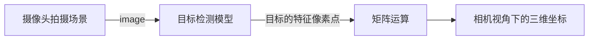

[toc]

# 一、运用

## 1.1 场景简介

***应用的限制条件如下：***

1. 地面平整，可视为平面；
2. 被检测目标均在地面上；
3. 相机高处固定，且知道其==焦距f、离地高度H以及光轴与水平线的夹角a==；


## 1.2 工作流程



## 1.3 快速运用

1. 将相机标定实验得到的内部参数cameraParams导入到matlab的工作区（具体流程请见4.1部分）

2. 在demo.m文件的第10行修改三个可控参数：`f、H以及a`，例如：

    1. ```matlab
        XYZ = CameraRanging(1113, 0, 4, cameraParams, points);
        ```

    2. $H=1113mm, a=0^。, f=4mm$

3. 在main.m文件中输入待测图片的路径，并选择是否进行畸变矫正，例如：

    1. ```matlab
        demo("input.jpg", cameraParams, 1)
        ```

    2. 矫正后内容会存储到当前目录的undistortion.jpg文件中

4. 运行main.m文件

5. 运行结果以及误差分析请见4.2-4.4部分

# 二、函数代码

## 2.1 detect_by_YOLOv4.m（目标检测）

- 输入参数
    - image_path：待处理图片的路径
- 返回值
    - points：目标特征像素点的坐标，存储格式为$[[u_1,v_1];...;[u_r,v_r]]$

```matlab
function points = detect_by_YOLOv4(image_path)
detector = yolov4ObjectDetector("csp-darknet53-coco"); % 加载目标检测模型
img = imread(image_path);
[bboxes,~,labels] = detect(detector,img); % 获取检测结果：目标的预测框以及标签
detectedImg = insertObjectAnnotation(img,"Rectangle",bboxes,labels);
[r,c] = size(bboxes);
points =  ones(r, c/2);
% 计算目标特征像素点的坐标
for i = 1:r
    points(i,1) = bboxes(i,1)+bboxes(i,3)/2;
    points(i,2) = bboxes(i,2)+bboxes(i,4);
end
% 在图片上展示检出效果
figure
imshow(detectedImg)
```

==bboxes变量存储模型输出的预测框，具体的数据格式为:$[[x_1,y_1,w_1,h_1],...,[x_n,y_n,w_n,h_n]]$，其中$[x_i,y_i,w_i,h_i]$表示第i个预测框左顶点的像素坐标$(x_i,y_i)$以及预测框的像素宽度$w_i$与像素长度$h_i$。==目标特征像素点的坐标如下：
$$
\begin{cases}
u=x+\frac{w}{2} \\
v=y+h
\end{cases}
$$

## 2.2 distotrtion_correction.m（畸变矫正）

`仅针对径向畸变的矫正`

- 输入参数
    - image_path：待处理图片的路径
    - cameraParams：相机内部参数，有相机标定实验得出
- 返回值
    - 无返回值

```matlab
function distotrtion_correction(image_path, cameraParams)
I=imread(image_path); % 读取原图路径
[J,~] = undistortImage(I,cameraParams); % 使用函数undistortImage去畸变
imwrite(J,'undistortion.jpg') % 将矫正后的图片保存为undistortion.jpg
```

## 2.3 CameraRanging.m（单相机测距）

<font color="red">建议先看完第三部分的内容再阅读代码！！！</font>

- 输入参数
    - H：相机离地面的高度，单位毫米；
    - alpha：相机光轴与水平线的夹角
    - f：相机的焦距，单位毫米
    - cameraParams：相机内部参数，有相机标定实验得出
    - points：目标的特征像素点坐标，格式为$[[x_1,y_1];...;[x_r,y_r]]$
- 返回值
    - XYZ：目标在相机视角下的三维坐标，存储格式为$[[X_1,Y_1,Z_1];...;[X_r,Y_r,Z_r]]$，单位毫米

```matlab
function XYZ = CameraRanging(H, alpha, f, cameraParams, points)
CameraIntrinsicMatrix = transpose(cameraParams.IntrinsicMatrix); % 内参矩阵
dx = f/CameraIntrinsicMatrix(1,1); % 获取像素点的宽度
dy = f/CameraIntrinsicMatrix(2,2); % 获取像素点的高度
temp = CameraIntrinsicMatrix;
temp(1,1) = 1/dx;
temp(2,2) = 1/dy;
TransformationMatrix = temp; % (u,v)->(x,y)的转换矩阵
[r, ~] = size(points); % 获取检测到的目标的数量
XYZ = ones(r, 3);
for i = 1:r
    xy1 = TransformationMatrix^(-1)*[points(i,1);points(i,2);1];
    b1 = atan2d(xy1(2),f);
    b = b1;
    c = b1 +  alpha;
    Z = H/sind(c)*cosd(b); % 得到特征像素点对应的深度
    XYZ(i,1:3) = CameraIntrinsicMatrix^(-1)*[points(i,1);points(i,2);1]*Z; % 得到目标在相机视角下的三维坐标
end
```

## 2.4 demo.m（是否矫正）

- 输入参数
    - image_path：待处理图片的路径
    - cameraParams：相机内部参数，有相机标定实验得出
    - is_correction：是否需要进行畸变矫正。如输入为1，则进行矫正；反之则不进行矫正。
- 返回值
    - 无返回值

```matlab
function demo(image_path, cameraParams, is_correction)
if is_correction == 1
    distotrtion_correction(image_path, cameraParams)
    points = detect_by_YOLOv4("undistortion.jpg");
else
    points = detect_by_YOLOv4(image_path);
end
disp("=============================物体像素坐标如下：=============================")
disp(points)
XYZ = CameraRanging(1113, 0, 4, cameraParams, points);
disp("=============================物体三维坐标如下：=============================")
disp(XYZ);
```

## 2.5 mian.m（程序运行文件）

```matlab
% cameraParams为camera calibrator实验获得的相机相关参数，必须保存在工作区才能运行此文件
demo("input.jpg", cameraParams, 1)
```

# 三、测距原理

## 3.1 目标

基于目标在图片上的特征像素点$(u,v)$，通过一系列有限的矩阵运行，得出它在相机坐标系下的三维坐标点$(X_c,Y_c,Z_c)$，进而可计算出相机与目标之间的欧式距离$d=\sqrt {X_c^2+Y_c^2+Z_c^2}$。

`Note：`目标在图片中的`特征像素点`定义为目标边框/预测框底边的中点，通过该点计算可计算出目标在相机视角下的位置。假设目标检测模型输出的预测框表示方式为$[x,y,w,h]$，其中$(x,y)$表示目标预测框左上角顶点在图片中的像素坐标，$w与h$分别表示预测框的宽和高（单位为像素），那么目标特征点的像素坐标的计算公式如下：
$$
\begin{cases}
u=x+\frac{w}{2} \\
v=y+h
\end{cases} \tag 1
$$


## 3.2 相机测距常见的四大坐标系


1. 世界坐标系：真实世界中任意指定原点的三维坐标系，坐标由$(X_w,Y_w,Z_w)$ 表示，用于描述相机在真实世界中的位置；
2. 相机坐标系：以相机透镜的几何中心（光心）为原点，坐标用$(X_c,Y_c,Z_c)$来表示，相机光轴为坐标系的Z轴，X轴水平，Y轴竖直，三者之间的关系如上图所示,单位米m；

3. 图像坐标系：以CCD图像的中心为原点，坐标由$(x,y)$ 表示，坐标原点为相机光轴与成像平面的交点（一般情况下，这个交点是接近于图像的正中心），单位毫米mm；
4. 像素坐标系：以像素为单位，坐标原点在图片的左上角，坐标由$(u,v)$ 表示，单位像素pixel

当然明显看出CCD传感器以mm单位到像素中间有转换的。举个例子，CCD传感上面的8mm x 6mm，转换到像素大小是640x480. 假如dx表示像素坐标系中每个像素的物理大小就是1/80 mm/pixel. 也就是说毫米与像素点的之间关系是piexl/mm.

<font color="red" size="6px">Note：本项目不考虑世界坐标系！</font>


参考资料

1. [(45条消息) 【相机标定】四个坐标系之间的变换关系_skycrygg的博客-CSDN博客](https://blog.csdn.net/qq_42518956/article/details/103903514?spm=1001.2101.3001.6661.1&utm_medium=distribute.pc_relevant_t0.none-task-blog-2~default~CTRLIST~Rate-1-103903514-blog-102974952.235^v38^pc_relevant_sort&depth_1-utm_source=distribute.pc_relevant_t0.none-task-blog-2~default~CTRLIST~Rate-1-103903514-blog-102974952.235^v38^pc_relevant_sort&utm_relevant_index=1)
2. [(45条消息) 世界坐标系、相机坐标系和图像坐标系的转换_相机坐标系到图像坐标系_滴滴滴'cv的博客-CSDN博客](https://blog.csdn.net/weixin_38842821/article/details/125933604?spm=1001.2101.3001.6650.7&utm_medium=distribute.pc_relevant.none-task-blog-2~default~BlogCommendFromBaidu~Rate-7-125933604-blog-102974952.235^v38^pc_relevant_sort&depth_1-utm_source=distribute.pc_relevant.none-task-blog-2~default~BlogCommendFromBaidu~Rate-7-125933604-blog-102974952.235^v38^pc_relevant_sort&utm_relevant_index=14)
3. [(45条消息) 相机标定（1）——四个坐标系_相机坐标系_白水煮蝎子的博客-CSDN博客](https://blog.csdn.net/weixin_44278406/article/details/112986651)

## 3.3 $(u,v)转(X_c,Y_c,Z_c)$

$$
\left[
\begin{matrix}
u \\
v \\
1
\end{matrix}
\right]
=
\frac{1}{Z_c}
\left[
\begin{matrix}
f_x & s & c_x \\
0 & f_y & c_y \\
0 & 0& 1
\end{matrix}
\right]
\left[
\begin{matrix}
X_c \\
Y_c \\
Z_c
\end{matrix}
\right]=
\frac{1}{Z_c}K
\left[
\begin{matrix}
X_c \\
Y_c \\
Z_c
\end{matrix}
\right] \tag 2
$$

$$
\left[
\begin{matrix}
X_c \\
Y_c \\
Z_c
\end{matrix}
\right]=Z_c\cdot K^{-1} \cdot
\left[
\begin{matrix}
u \\
v \\
1
\end{matrix}
\right] \tag 3
$$

$$
K^{-1}=
\left[
\begin{matrix}
\frac{1}{f_x} & -\frac{s}{f_xf_y} & \frac{c_ys-c_xf_y}{f_xf_y} \\
0 & \frac{1}{f_y} & -\frac{c_y}{f_y} \\
0 & 0& 1
\end{matrix}
\right] \tag 4
$$

- $(u,v)$：物体Q特征点像素点的坐标，可从图片上得到；
- $(X_c,Y_c,Z_c)$：物体Q在相机视角下的坐标点，待求；
- $K$：相机的内参矩阵，描述了三维坐标与二维坐标转换关系，可由==相机标定实验（具体操作请见应用流程部分）==得出。
    - $(c_x,c_y)$：成像平面中心点在图片像素坐标系下的坐标点
    - $s(skwed)$：[歪斜参数](http://ksimek.github.io/perspective_camera_toy.html)，像素x轴与y轴形成的夹角的大小情况，当x轴与y轴垂直时$s=0$，一般都默认为零
    - $f_{x\ or\ y}$：以像素单位表示的焦距。若像素点为正方形，则$f_x=f_y$，若像素点为长方形，则$f_x \neq f_y$。

==从等式（2）或者（3）中仅可得到两个三元一次方程，故无法求出$(X_c,Y_c,Z_c)$==。但可以通过使用==深度估计模型或特定场景下的几何测量法==获得$Z_c$值。由于本项的目场景具有许多先验数据，例如相机高度等，故采用几何关系测量法，具体的建模与计算方法如下。

## 3.4 应用场景分析

交通路口高架上的单目相机测距场景具有以下特性：

1. 相机距离水平面的高度`H`可人工测量；
2. 相机光轴与水平线的夹角`a`可人工测量；
3. 将路面视为光滑的平面；
4. 焦距$f$已知。

如下图所示，$X_c Y_c Z_c$表示相机坐标系，$xo_1y$表示平面成像坐标系（图像物理坐标系）


需要注意的是，在该场景下，==参与计算的物体必须站在地面上==。

## 3.5 计算目标特征像素点的深度$Z_c$

$$
b^{'}=arctan\frac{0_1P^{'}}{f} \\
\angle b^{'} = \angle b \\
\angle c = \angle b + \angle a \\
OP = \frac{H}{sinc} \\
OD = OP \times cosb \\
Z_c = OD
$$

$$
Z_c =\frac{H}{sin(\angle a + \angle arctan\frac{0_1P^{'}}{f})} \times cosb \tag 5
$$

$$
\begin{cases}
X_c=\frac{f_y(u-c_x)-s(v-c_y)}{f_xf_y}\times Z_c \\
Y_c=\frac{v-c_y}{f_y} \times Z_c
\end{cases} \tag 6
$$

==如何得到$o_1P^{'}$的值呢？即如何得到图像坐标的y值呢？==

## 3.6 $(u,v)转(x,y)$

首先是`像素坐标系UV`和`图像坐标系XY`之间的关系。在拿到一张照片之后，我们应该可以想到，这其实是一张由一个一个像素组成的图像，并且我们可以很简单地拿到像素的坐标，也即$(u,v)$。但这个坐标只是图像上用来指示像素的位置，并不是物理的成像平面上的坐标，因此不能直接用于三维坐标的恢复。这个时候我们需要先去恢复图像坐标$(x,y)$，也即物理的成像平面上的坐标。设像素点的长宽分别为$dx与dy$。


$$
\begin{cases}
u=\frac{x}{dx}+u_0 \\
v=\frac{y}{dy}+v_0
\end{cases} \iff
\left[
\begin{matrix}
u \\
v \\
1
\end{matrix}
\right]
=
\left[
\begin{matrix}
\frac{1}{dx} & s & u_0 \\
0 & \frac{1}{dy} & v_0 \\
0 & 0& 1
\end{matrix}
\right]
\left[
\begin{matrix}
x \\
y \\
1
\end{matrix}
\right] \tag 7
$$

$$
o_1p^{'} = y \tag 8
$$

1. $(u_0,v_0)$图像坐标系的原点在像素坐标系当中的坐标；理想情况下，若图片尺寸为$W \times H$，那么$u_0=\frac{W}{2},v_0=\frac{H}{2}$；
2. $dx$：表示x轴方向上的一个像素在相机感光板上的物理长度，即一个像素在感光板上是多少毫米；
3. $dy$：表示y轴方向上的一个像素在相机感光板上的物理长度

## 3.7 计算$dx$与$dy$

通过`相机标定`可以得到一个具体的$3 \times 3$内参矩阵，如下所示：
$$
\left[
\begin{matrix}
x_{11} & x_{12} & x_{13} \\
x_{21} & x_{22} & x_{23} \\
x_{31} & x_{32} & x_{33} 
\end{matrix}
\right]
$$
焦距$f$由相机的商品包装给出，则
$$
K=
\left[
\begin{matrix}
f_x & s & c_x \\
0 & f_y & c_y \\
0 & 0& 1
\end{matrix}
\right]=
\left[
\begin{matrix}
\frac{f}{dx} & s & c_x \\
0 & \frac{f}{dy} & c_y \\
0 & 0& 1
\end{matrix}
\right]=
\left[
\begin{matrix}
x_{11} & x_{12} & x_{13} \\
x_{21} & x_{22} & x_{23} \\
x_{31} & x_{32} & x_{33} 
\end{matrix}
\right](u_0 = c_x;v_0 = c_y)
$$

$$
\frac{f}{dx}=x_{11} & or & \frac{f}{dy}=x_{22}\\
dx=\frac{f}{x_{11}} & or & dy=\frac{f}{x_{22}}\tag 9
$$

此时，通过公式（3）可将目标图片上的特征像素点$(u,y)$转换成相机视角下的空间位置$(X_c,Y_c,Z_c)$。

参考文章

1. [理想针孔相机模型入门：从像素坐标系到相机坐标系 - 知乎 (zhihu.com)](https://zhuanlan.zhihu.com/p/331832549)  

# 四、实验

## 4.1 相机标定流程

需要有

1. 固定相机，测量高度`H`以及夹角`a`
2. 拍摄标定板，且需要满足以下规范，标定图片的获取地址为https://github.com/AprilRobotics/apriltag-imgs/archive/master.zip
    - 在标定的整个过程中焦距f不变；
    - 拍摄的图片最好为摄像头视野的1/4左右；
    - 不要只拍摄标定板与镜头面平行的图片，也要拍摄一些有倾斜角度的图片；
    - 在摄像头视野内五个不同位置上（左上、右上、左下、右下、正中心）分别拍摄图片；
    - 保证标定板的亮度足够且均匀，同时拍摄的图片必须清晰；
    - 图片数量20~25张；

3. 打开matlab的相机标定APP
4. 现在拍摄的图片
5. 选择标定算法并填写标定板的详细信息，若没有AprilTag选项请见参考文献链接3网页中`Import Custom Pattern Detector Class`部分的内容
6. 三个参数的时候由于k3所对应的非线性较为剧烈。估计的不好，容易产生极大的扭曲，所以我们在MATLAB中选择使用两参数，并且选择错切和桶形畸变，然后由matlab计算出相机的参数。 ==（3不用勾选）==
7. 将得到的相机内部参数cameraParams导入到matlab的工作区
8. 查看内参矩阵，标定实验到此结束！

==matlab中获得的内参矩阵需要转置后才能使用！！！==

参考文献

1. [相机标定的规范 - 知乎 (zhihu.com)](https://zhuanlan.zhihu.com/p/404073034)
2. [相机标定—>标定图片拍摄规范（附棋盘图）_标定棋盘格图片_Panda..的博客-CSDN博客](https://blog.csdn.net/y2c58s43d69g8h7G_g/article/details/97231596)
3. [Camera Calibration Using AprilTag Markers - MATLAB & Simulink - MathWorks 中国](https://ww2.mathworks.cn/help/vision/ug/camera-calibration-using-apriltag-markers.html)

## 4.2 无角度测距实验

### 4.2.1 实验设置

- 相机焦距f为4mm；
- 相机光轴与水平线的夹角为零；
- H相机的离地高度为xxxmm
- 目标摆放
    - 

- 相机摆放
    - 


==此时有如下推导==
$$
a=0时，由公式(5)得：
Z_c=H \cdot \frac{cosb}{sinb}=H \cdot cotb=H \cdot \frac{f}{o_1P^{'}} \\
结合公式(8)可得：Z_c=H \cdot \frac{f}{y}\\
由公式(6)可得：Y_c=\frac{v-c_y}{f_y} \cdot Z_c=\frac{v-c_y}{f_y} \cdot H \cdot \frac{f}{y} \\
由公式(7)可得：y=dy(v-c_y) \\
则 Y_c==\frac{v-c_y}{\frac{f}{dy}} \cdot H \cdot \frac{f}{dy(v-c_y)}=H \\
即Y_c=H
$$

### 4.2.2 实验结果

#### prediction vs truth


|      | 像素坐标           | prediction（毫米）  | truth（毫米）      | error（t—p）     |
| ---- | ------------------ | ------------------- | ------------------ | ---------------- |
| 2    | （953.2，1053.2）  | （47，1113，3494）  | （65，1113，3230） | （18，0，-264）  |
| 3    | （948.0，970.4）   | （43，1113，4077）  | （65，1113，3830） | （22，0，-247）  |
| 4    | （1215.6，1051.1） | (547，1113，3507)   | (665，1113，3230)  | （118，0，-277） |
| 5    | （1207.5，1047.3） | （535，1113，3530） | (655，1113，3230)  | （120，0，-300） |

#### uncorrection vs correction


|      | 像素坐标          | prediction(uncorrection) | prediction(correction) | truth            | error          |
| ---- | ----------------- | ------------------------ | ---------------------- | ---------------- | -------------- |
| 2    | （954.0,1073.1）  | （47,1113,3494）         | （47,1113,3378）       | （65,1113,3230） | （18,0,-148）  |
| 3    | （948.3,992.6）   | （43,1113,4077）         | （42,1113,3903）       | （65,1113,3830） | （23,0,-73）   |
| 4    | （1221.6,1078.1） | (547,1113,3507)          | （534,1113,3350）      | (665,1113,3230)  | （131,0,-120） |
| 5    | （1224.9,1072.3） | （535,1113,3530）        | （545 ,1113,3382）     | (655,1113,3230)  | （110,0,-152） |

#### summary

当摄像头光轴与水平线没有夹角是，对于程序给出的结果$(X,Y,Z)$，有以下结果：

- 分类$X与Z$的误差范围为$[0,30cm]$，$Y=1113$符合理论推导；
- 径向畸的变矫正对$Z$的影响大，可以有效提高测距精度；
- 径向畸变的矫正对$X$的影响非常小，对测距精度的提升没什么效果；

## 4.3 有角度测距实验

暂无，可自行尝试。

## 4.4 误差分析

本场景下的误差主要来自以下几个方面：

1. 相机高度H与夹角a测量不准确（`使用专业地设备测量，例如激光测距笔`）；
2. 目标检测模型输出的预测框与目标真实边框之间的IOU过小，导致获得的特征像素点$(u,v)$不准确，进而造成测距不精准`(模型训练时，尽可能地提高IOU阈值)`；
3. 目标检测模型不能检测出所有的待计算目标；
4. 镜片畸变现象导致像素点不能按照理想得情况分布，例如现实中的直被拍成了曲线等`（可使用畸变参数进行纠正若图片边缘没有目标，则不用进行畸变矫正；反之，则需要进行矫正以提高计算的精度；）`；
5. 目标在相机坐标系下的三维坐标人工测量不准（`使用专业地设备测量，例如激光测距笔`）；
6. 相机内部结构损坏（`无法避免，只能换一个新地`）；
7. 标定实验得到的内参矩阵不合理（`满足标定板的拍摄规范`）；

